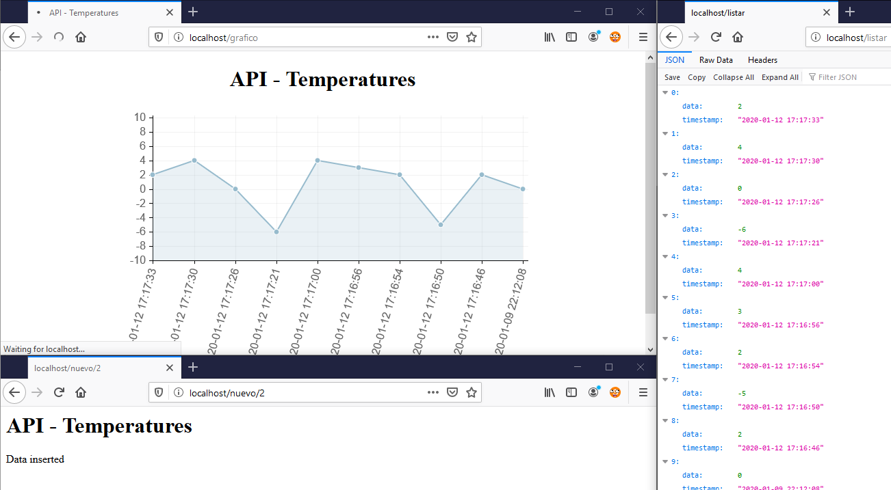

[](https://hub.docker.com/_/python) [](https://coveralls.io/github/shotgunsoftware/python-api?branch=master) [](https://twitter.com/adrisalas_)  

# Python API with Redis on a Docker Stack

Simple project to serve as a basis for creating APIs in Python using Flask and Redis on a Docker Stack

## Installation

```bash
git clone https://github.com/adrisalas/python-api-redis.git
docker swarm init
docker stack deploy -c docker-compose.yml getstartedlab
```

## Usage

Introducing new data
```http
http://<external-ip>/nuevo/2
http://<external-ip>/nuevo/-5
http://<external-ip>/nuevo/2
http://<external-ip>/nuevo/4
```
Show real-time graph _[Chart.js](https://www.chartjs.org/)_
```http
http://<external-ip>/grafico
```
Full list the API _JSON Format_
```http
http://<external-ip>/listar
```
Query 10 last data _JSON Format_
```http
http://<external-ip>/listajson
```
Shutdown
```http
http://<external-ip>/nuevo/404
```
Flush Redis Server
```http
http://<external-ip>/flush
```


## Screenshots



